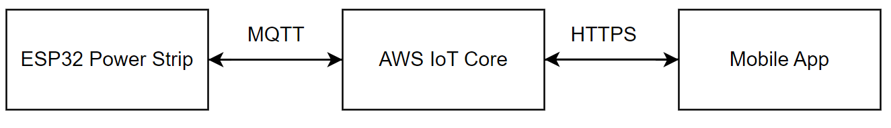

<h2> Internet of Things based Smart Power Strip <h2>

## Introduction
This firmware development project focuses on an ESP32-based smart power strip system utilizing IoT. The power strip is connected remotely through AWS IoT with a mobile app. The ESP32 manages the sockets via GPIO-connected relays and updates status on an LCD screen through I2C. Communication with the mobile app is facilitated through AWS Device Shadow and MQTT protocols.


The firmware developemnt was divided into:
* WiFi Connection/Disconnection:  Event group was used to achieve schronizing the occurence of wifi connection to the main task(thread)
* AWS IoT core connection: Connecting to AWS cloud using certs and keys, subcribe/publishing to an MQTT topic (device shadow)
* Driver Device: I2C development to communication with the lcd and gpio development to communicate with the relays.

The above was achieved using ESP IDF.

## Requirement
The requirements include:
* Control 4 sockets using 4 relays
* Display the status of the relay on an LCD screen
* Connect to AWS IoT core and use AWS Device Shadow to manage interaction between power strip and  mobile application.
* Enable connection to a WiFi network.
* Able to rollout firmware update (OTA firmware update)

## Components Used 
The components used are below:
* MCU - ESP32
* Display Screen - 20 x 4 Lcd screen module
* Relay and circuitry

## Hardware Connection

| ESP 32      | LCD Screen                                   |
|-------------|----------------------------------------------|
| GPIO 18     | SDA                                          |
| GPIO 19     | SCL                                          |

The relays were connected to gpio 23, gpio 22, gpio 21, gpio 5.

## Get Started
- Follow through this [link](https://docs.espressif.com/projects/esp-idf/en/stable/esp32/get-started/index.html) to set up esp idf.

- Follow through this [link](https://docs.aws.amazon.com/iot/latest/developerguide/what-is-aws-iot.html) to create certificate and keys for AWS IoT.

- Clone the repository 
```bash
$ git clone https://github.com/mrdean05/smart-power-strip.git
```

- Seed into the repo
```bash
$ cd smart-power-strip
```

- Set up your credentials on IoT core and obtain the keys and certss

- Build your project
```bash
$ idf.py build
```

- Flash your project and monitor/debug logs
```bash
$ idf.py -p [COM_NUMBER] flash monitor 
```