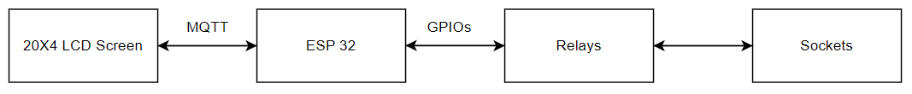

<h2> ESP 32 based Appliance Control<h2>

## Introduction
This firmware development project focuses on an ESP32-based appliance control system utilizing IoT. Through AWS IoT, it enables remote appliance management via a dedicated mobile application. The ESP32 manages appliances via GPIO-connected relays and updates status on an LCD screen through I2C. Communication with the mobile app is facilitated through AWS Device Shadow and MQTT protocols.



The firmware developemnt was divided into:
* WiFi Connection/Disconnection:  Event group was used to achieve schronizing the occurence of wifi connection to the main task(thread)
* AWS IoT core connection: Connecting to AWS cloud using certs amd keys, subcribe/publishing to an MQTT topic (device shadow)
* Driver Device: I2C development to communication with the lcd and gpio development to communicate with the relays.

The above was achieved using ESP IDF.

## Hardware Connection

| ESP 32      | LCD Screen                                   |
|-------------|----------------------------------------------|
| GPIO 18     | SDA                                          |
| GPIO 19     | SCL                                          |

The relays were connected to gpio 23, gpio 22, gpio 21, gpio 5.

## Get Started
- Follow through this [link](https://docs.espressif.com/projects/esp-idf/en/stable/esp32/get-started/index.html) to set up esp idf.

- Clone the repository 
```bash
$ git clone https://github.com/mrdean05/time_based_appliance_control.git
```

- Seed into the repo
```bash
$ cd time_based_appliance_control
```

- Set up your credentials on IoT core and obtain the keys and certs

- Build your project
```bash
$ idf.py build
```

- Flash your project and monitor/debug logs
```bash
$ idf.py -p [COM_NUMBER] flash monitor 
```